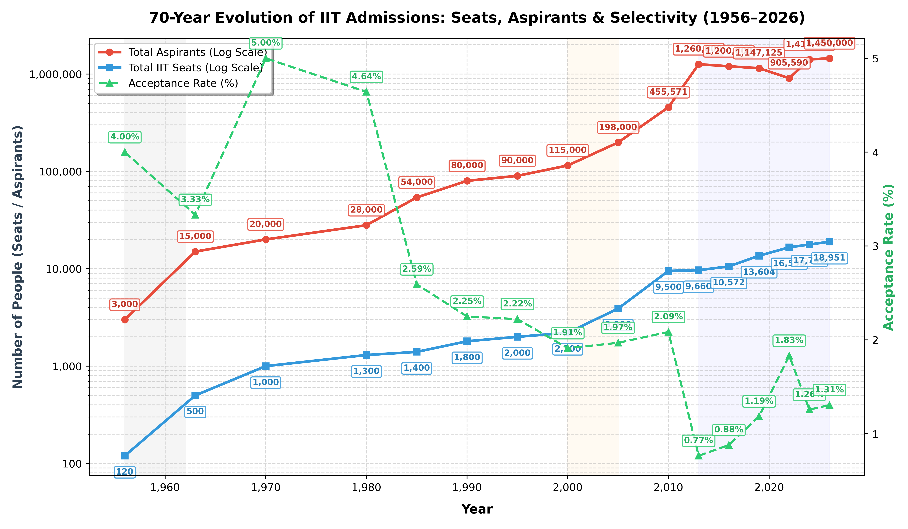

# 🎓 JEE Aspirants vs IIT Acceptance Rate (1956-2026) 📈

<p align="center">
  
</p>



## 🌟 Overview
A data visualization project mapping the 70-year history of the Joint Entrance Examination (JEE) in India 🇮🇳. This project analyzes the historic growth of IIT aspirants against the total available seats across Indian Institutes of Technology (IITs), highlighting the stark evolution of the acceptance rate from 1956 to 2026 🏫.

## ✨ Features
- 📊 **Historical Data Visualization**: Plots total aspirants and available seats on a logarithmic scale for better visualization of exponential growth.
- 🎯 **Selectivity Tracking**: Calculates and visualizes the precise acceptance rate over time on a shared axis.
- ⏳ **Era Highlighting**: Highlights different eras of the examination, such as the Early Era, Screening Test Era, and the Two-Tier JEE Era.
- 📝 **Data Annotations**: Features detailed annotations for all data points for quick and accurate reading of historical numbers.

## 📅 Data Points Analyzed
The script includes milestones representing major structural changes to the examination process over the decades:
- **1950s - 1990s**: The early days and steady growth 🌱.
- **2000 - 2005**: Introduction and impact of the Screening Test 📝.
- **2013 - Present**: The modern Two-Tier format (JEE Main & JEE Advanced) 🚀.

## 🛠️ Setup & Usage
1. Clone the repository 📥:
   ```bash
   git clone https://github.com/ishandutta2007/JEE-Aspirants-vs-Acceptance.git
   ```
2. Install the required dependencies 📦:
   ```bash
   pip install matplotlib numpy
   ```
3. Run the visualization script 🏃:
   ```bash
   python JEE_Aspirants_vs_Acceptance.py
   ```
   
## 📸 Output
The script automatically generates and saves an HD image of the plot (`assets/jee_acceptance_rate.png`) and opens an interactive visualization window.

## 🔑 Keywords
`JEE Advanced` 🏆, `JEE Mains` 🎓, `IIT Acceptance Rate` 📉, `IIT Seats History` 🏛️, `JEE Aspirants Data` 🧑‍🎓, `Indian Institutes of Technology` 🏫, `Data Visualization` 📊, `Python` 🐍, `Matplotlib` 📈, `Education Data` 📚
